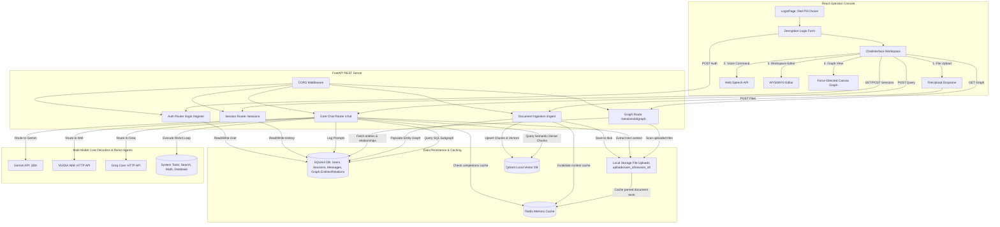

# 🟢 The Matrix Oracle Chatbot & Operator Workspace

[](https://python.org)
[](https://react.dev)
[](https://fastapi.tiangolo.com)
[](https://tailwindcss.com)
[](https://vitejs.dev)
[](https://sqlite.org)
[](https://redis.io)
[](https://qdrant.tech)

An immersive, secure, multi-model RAG chatbot and operator console simulating a retro-futuristic green-phosphor CRT screen. The chatbot adopts the persona of the **Oracle** from *The Matrix* film trilogy, serving as an expert guide on Matrix lore and Computer Science.

---

## 📸 Visual Interface Features

* **Authentic Matrix Rain**: High-performance Canvas-based rain featuring genuine Japanese Katakana glyphs, white leading heads (head-of-drop) with phosphor green trails, and variable fall speeds.
* **CRT Glass Screen Simulation**: Grid scanline overlays, subtle high-frequency screen flicker, and radial vignette curves that mimic active cathode-ray tube terminals.
* **Text Glitch animations**: Interactive cyberpunk header displacement glitches.
* **Animated Character Decoders**: Text responses reveal themselves by transitioning random Matrix glyphs into actual readable characters.
* **Obsidian-Style Subgraph Visualizer**: Canvas-based interactive force-directed graph displaying documents and semantic entities as glowing neural nodes.

---

## 🎭 The Oracle Agent Persona (Screen-Accurate)

The AI Agent is configured to reflect the **Oracle's screen-accurate personality**:
* **Tone**: Warm, motherly, relaxed, wise, and comfortable, yet deeply cryptic and knowing.
* **Analogies**: Often uses cookies, baking, or candy metaphors to explain complex programming algorithms or database concepts.
* **Dialogue style**: Always addresses the user as "Neo", "Operator", or "child", discussing choices, paths, free will, and understanding the *why* behind decisions.
* **Expertise Bounds**: Strict boundaries limiting expertise strictly to **Matrix timeline facts** and **Computer Science concepts**. Queries outside these areas will be declined politely *in character* (e.g. offering a virtual cookie instead).

---

## 🚀 Scalable Hybrid Graph RAG Architecture

The system implements a cutting-edge cross between **Hybrid RAG** and **Graph RAG** in [rag_manager.py](file:///F:/Matrix/redpill-backend/utils/rag_manager.py) to scale to search and retrieve across thousands of PDF and Word documents securely:

### 1. Vector Database: Qdrant (Wise Choice)
* **Why**: Written in Rust, Qdrant is extremely fast, highly memory-efficient, and supports native metadata filtering. We use a **disk-persisted local Qdrant instance** (`qdrant_db/`) that stores vectors locally without needing external Docker container daemons, making the project 100% portable and easy to distribute.

### 2. Embeddings Model: Gemini `text-embedding-004` (Wise Choice)
* **Why**: Generates highly accurate 768-dimensional semantic dense vectors. Offloading embedding computations to the Gemini API keeps the local operator client lightweight, ensuring zero local GPU/CPU stress, while using the same secure API key configured for chat.

### 3. Context Processing & Retrieval Loop
During file upload (`/ingest`), documents are parsed, chunked, and processed:
* **Dense Retrieval (Semantic)**: Chunks are embedded via Gemini and cached in the local Qdrant collection, filtered instantly by `session_id`.
* **Sparse Retrieval (Keyword/Lexical)**: An in-memory, session-bound inverse document scoring index (similar to BM25) matches exact nomenclature (e.g. "Nebuchadnezzar" vs "hovercraft") that semantic search can miss.
* **Graph Retrieval (Entity-Relations)**: Text chunks are scanned to extract key Matrix and CS entities. Proximity relationships (e.g. `Neo --(LOVES)--> Trinity`, `Morpheus --(COMMANDS)--> Nebuchadnezzar`) are indexed into SQLite tables.
* **Fused Context Generation**: When a query hits `/chat`, Qdrant dense chunks, sparse keyword chunks, and relevant relational graphs are fused together into a structured prompt context block and supplied to the Oracle.

---

## 📁 Obsidian-Style Graph & User Isolation Storage

### 1. Knowledge Graph Visualizer (`GraphView.tsx`)
A custom-engineered **Force-Directed Graph Visualization** is drawn inside the right-hand panel tabs under "Graph View":
* **Force Simulation**: Runs real-time physics (Coulomb's repulsion, Hooke's attraction spring lines, gravity pull, friction damping) on an HTML5 `<canvas>` using `requestAnimationFrame`.
* **Node Types**: Entity nodes glow in neon green (or mint green for people), while uploaded document nodes glow in bright cyber cyan.
* **Interactivity**: Clicking and dragging nodes pins them at customized coordinates; hovering shows entity classifications and descriptions inside a retro CRT HUD card.

### 2. Isolated User Storage Directory
* Uploaded files are isolated per user under `uploads/user_{user_id}/session_{session_id}/`.
* The FastAPI backend automatically resolves `user_id` by querying SQLite relative to the `session_id` to establish path security.
* **Pluggable Cloud Backup**: The architecture supports a pluggable interface for Google Drive folder uploads. When Drive sync is toggled in the configurations, files are uploaded to custom user directories on Drive alongside the local storage copies.

---

## ⚡ Single-Click Command Utilities (.bat)

To make launching services and verifying systems straightforward, the root directory features two Windows batch executables:
1. **[start_project.bat](file:///F:/Matrix/start_project.bat)**: Launches the FastAPI backend reload server, spins up the Vite React interface, and redirects the browser window to `http://localhost:3000` automatically.
2. **[run_tests.bat](file:///F:/Matrix/run_tests.bat)**: Runs the pytest suite with the `TESTING=True` environment variable. This forces SQLite and Qdrant to run in in-memory mode, avoiding database lock contentions with active servers and completing tests instantly.

---

## 🛠️ Tech Stack & Architecture

### Frontend
* **Core**: React 18, Vite, TypeScript.
* **Style System**: TailwindCSS & Custom CRT shaders in CSS.
* **Components**: Radix UI (via shadcn/ui primitives), Lucide Icons, React Dropzone.
* **State & Querying**: Axios Client, localStorage verification.

### Backend
* **API Framework**: FastAPI (Uvicorn HTTP Engine).
* **Database & Memory**: SQLite3 (relational log history & relational knowledge graphs), **Redis** (performance caching & context engineering), and **Qdrant** (local vector index).
* **LLM Integrations**: Google GenAI SDK, NVIDIA NIM (OpenAI compatible), and Groq Core (OpenAI compatible).

### System Diagram



---

## ⚡ Redis Caching & Context Engineering

To optimize API latency, reduce token billing, and accelerate client responses, the backend implements a robust multi-tiered **Redis caching manager** in [redis_cache.py](file:///F:/Matrix/redpill-backend/utils/redis_cache.py):

1. **LLM Completions Cache**: Chat queries are hashed based on the `provider`, `model_name`, `rag_context`, and the `message`. If matching, the cached output returns instantly, bypassing API calls.
2. **Parsed File Cache**: Individual document parsing (PDF, DOCX) is cached keyed by filepath and modification timestamp. Files are only parsed when changes occur.
3. **Session Context Cache**: Compiled document structures for active sessions are cached in Redis, avoiding repetitive disk scans.
4. **Graceful Failover**: If the local Redis daemon is offline, the service automatically routes caching to an in-memory dictionary.

*Refer to the [redis_setup_guide.md](file:///F:/Matrix/documents/redis_setup_guide.md) for detailed steps on setting up Redis on a Windows computer.*

---

## 🛠️ ReAct Agent Tools Integration

The Oracle is equipped with a provider-agnostic **ReAct (Reasoning + Acting) loop** in [llm_service.py](file:///F:/Matrix/redpill-backend/services/llm_service.py). This allows Gemini, NVIDIA NIM, and Groq models to invoke real-time utilities defined in [tools.py](file:///F:/Matrix/redpill-backend/utils/tools.py):

1. **`web_search(<query>)`**: Connects to DuckDuckGo's HTML query portal to scrape title, link, and snippets of top 5 web results.
2. **`calculate(<math_expr>)`**: Secure mathematical expression parser to execute equations accurately without model hallucination.
3. **`matrix_lore_lookup(<term>)`**: Instant local lookup of key Matrix lore (Nebuchadnezzar specs, Zion timelines, Agent profiles) matching exact trilogy facts.

---

## 📊 Database Schema

SQLite3 database (`chat_history.db`) manages secure sessions, user data, and the relational knowledge graph:

```
┌────────────────────────────────────────────────────────┐
│                        users                           │
├───────────────────┬───────────────────┬────────────────┤
│ id                │ INTEGER           │ PRIMARY KEY    │
│ username          │ TEXT              │ UNIQUE, NOT NULL│
│ password          │ TEXT              │ HASHED (bcrypt)│
│ full_name         │ TEXT              │ NULLABLE       │
│ dob               │ TEXT              │ NULLABLE       │
│ email             │ TEXT              │ NULLABLE       │
│ profile_pic_path  │ TEXT              │ NULLABLE       │
└───────────────────┴───────────────────┴────────────────┘
                         │
                         ▼ (1 to Many)
┌────────────────────────────────────────────────────────┐
│                    chat_sessions                       │
├───────────────────┬───────────────────┬────────────────┤
│ id                │ INTEGER           │ PRIMARY KEY    │
│ user_id           │ INTEGER           │ FOREIGN KEY    │
│ name              │ TEXT              │ NULLABLE       │
│ timestamp         │ DATETIME          │ DEFAULT NOW    │
└───────────────────┴───────────────────┴────────────────┘
            │                        │
            ▼ (1 to Many)            ▼ (1 to Many)
┌───────────────────────┐    ┌───────────────────────────────────┐
│     chat_messages     │    │          graph_entities           │
├───────────┬───────────┤    ├───────────┬───────────┬───────────┤
│ id        │ INT (PK)  │    │ id        │ INT (PK)  │           │
│ session_id│ INT (FK)  │    │ session_id│ INT (FK)  │           │
│ sender    │ TEXT      │    │ name      │ TEXT      │ UNIQUE    │
│ message   │ TEXT      │    │ type      │ TEXT      │           │
│ timestamp │ DATETIME  │    │ description│ TEXT     │           │
└───────────┴───────────┘    └───────────┴───────────┴───────────┘
                                     │
                                     ▼ (1 to Many source/target)
                             ┌───────────────────────────────────┐
                             │          graph_relations          │
                             ├───────────┬───────────┬───────────┤
                             │ id        │ INT (PK)  │           │
                             │ session_id│ INT (FK)  │           │
                             │ source    │ TEXT      │           │
                             │ target    │ TEXT      │           │
                             │ relation  │ TEXT      │ UNIQUE    │
                             │ description│ TEXT     │           │
                             └───────────┴───────────┴───────────┘
```

---

## 🔌 API Endpoints Specification

### 1. Authentication
* **`POST /register`**: Initialize new operator credentials.
  * Request: `{"username": "neo", "password": "securepassword"}`
* **`POST /login`**: Validate passcode and return profile metadata.
  * Request: `{"username": "neo", "password": "securepassword"}`
  * Response: `{"id": 1, "username": "neo", "message": "Login successful"}`

### 2. Sessions
* **`POST /sessions`**: Open a new neural connection channel.
  * Request: `{"user_id": 1, "name": "Nebuchadnezzar Deck"}`
* **`GET /sessions?user_id=1`**: Fetch all chat session histories for user.
* **`PUT /sessions/{session_id}`**: Re-label a session.
  * Request: `{"name": "Zion Archive Core"}`
* **`DELETE /sessions/{session_id}`**: Terminate session and purge RAG documents.
* **`POST /sessions/{session_id}/clear`**: Wipe conversation logs without deleting uploaded files.

### 3. Context Ingestion (RAG)
* **`POST /ingest`**: Upload files for session contextualization.
  * Content-Type: `multipart/form-data`
  * Body parameters: `session_id: int`, `files: List[UploadFile]`

### 4. Graph Visualizer
* **`GET /sessions/{session_id}/graph`**: Retrieve structured entities, relationships, and documents.
  * Response:
    ```json
    {
      "nodes": [
        {"id": "neo", "label": "NEO", "type": "Person", "description": "..."},
        {"id": "doc:timeline.pdf", "label": "timeline.pdf", "type": "Document", "description": "..."}
      ],
      "edges": [
        {"source": "neo", "target": "doc:timeline.pdf", "label": "CONTAINED_IN", "description": "..."}
      ]
    }
    ```

### 5. Oracle Core Chat
* **`POST /chat`**: Query the Oracle decoders.
  * Request:
    ```json
    {
      "session_id": 1,
      "message": "Who is the Architect?",
      "provider": "nvidia",
      "model_name": "nvidia/llama-3.1-nemotron-70b-instruct"
    }
    ```
  * Response: `{"response": "The Architect is the creator of the Matrix... a system based on mathematics..."}`

---

## 🚀 Setup & Installation

### 1. Repository Clones & Environment
Create a `.env` file at the root workspace directory:
```env
GOOGLE_API_KEY=your_gemini_api_key
NVIDIA_API_KEY=your_nvidia_nim_api_key
GROQ_API_KEY=your_groq_api_key
REDIS_HOST=localhost
REDIS_PORT=6379
```

### 2. Backend Setup
Navigate to the backend directory and install dependencies:
Using **UV** (highly recommended for performance):
```bash
cd redpill-backend
uv pip install -e .
```
Using standard **pip**:
```bash
cd redpill-backend
pip install -r requirements.txt
```

Launch the Uvicorn engine:
```bash
python -m uvicorn app.main:app --host 0.0.0.0 --port 8001
```

*(Optional) Start the Python Streamlit alternative UI:*
```bash
streamlit run stapp.py
```

### 3. Frontend Setup
Navigate to the interface directory, install packages, and boot the Vite server:
```bash
cd redpill-interface
npm install
npm run dev
```

Open `http://localhost:3000` in your browser. Choose the **Red Pill** to decrypt terminal entry.

---

## 🔒 Enterprise Security & Resiliency Controls

1. **Path Traversal Shield**: The `/ingest` file reader sanitizes upload payloads using `os.path.basename` to prevent write traversals outside the session workspace.
2. **SQLite Thread Concurrency**: DB connection pools are configured with `timeout=15.0` to wait on database locks.
3. **Internal Server Shields**: Uncaught python runtime failures are mapped to generic, structured JSON responses, shielding back-end system tracebacks.
4. **Credential Hashing**: Password strings are protected with cryptographic salt loops in `bcrypt` before storing.
5. **OpenAI Error Filters**: Truncation utilities extract messages from external API exceptions, avoiding verbose stack-trace leaks into the UI.
