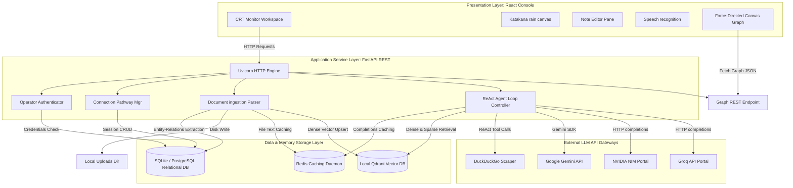

# 🟢 High-Level Design (HLD) - Matrix Oracle Workspace

This document defines the High-Level Design (HLD) for the **Matrix Oracle Chatbot and Operator Workspace**, outlining the system context, component blocks, global data flows, and architectural design principles.

---

## 1. System Overview & Objectives
The Matrix Oracle Workspace is a secure, local-first retrieval-augmented generation (RAG) assistant console. The chatbot adopts the persona of the **Oracle** from *The Matrix* trilogy, serving as a domain expert in Matrix film lore and Computer Science.

### Architectural Objectives:
1. **Interactive UI**: A retro-futuristic CRT monitor theme with canvas digital rain and phosphor flickering.
2. **Flexible Multi-Model Routing**: Dynamic routing across Gemini (native SDK), NVIDIA NIM (HTTP API), and Groq (HTTP API).
3. **Scalable Hybrid Graph RAG**: Capability to parse, chunk, vector-index, and semantically link thousands of documents local-first.
4. **Relational Database Portability**: Dual-mode storage layers that support local SQLite and production-grade PostgreSQL.
5. **Optimized Latency**: Multi-tiered Redis caching for parsed file contents, session contexts, and model completions.

---

## 2. System Architecture Context

---

## 3. High-Level Components Description

### A. Presentation Layer (Vite + React + TS)
* **LoginPage**: A red-pill choice terminal gateway simulating decryption sequences.
* **ChatInterface**: Double-pane operator layout. The left side handles conversation streams and pathway configurations. The right side contains tabs for note workspace writing (`Editor`), captures (`Output`), and the `Graph View` (Canvas-based visual knowledge graph).
* **MatrixBackground**: High-performance rendering of half-width Katakana code rain.
* **GraphView**: Interactive visual representation of session files and semantic nodes using a custom force-directed physics layout.

### B. Application Service Layer (FastAPI)
* **Auth Service**: Implements secure user sign-ups and logins utilizing `bcrypt` password salt cycles.
* **Ingestion Pipeline**: Sanitizes file path transfers (`os.path.basename`) and reads PDF, DOCX, TXT, and Markdown files.
* **Hybrid Graph RAG Manager**: Coordinates chunk processing, semantic dense embedding calculation, lexical token mapping, and SQL knowledge graph extraction.
* **LLM Service (ReAct Agent)**: Implements a provider-agnostic loop. If a tool is requested (e.g. `web_search`), it executes the tool locally, appends results to the history, and prompts the model again.

### C. Data & Caching Storage Layer
* **SQLite / PostgreSQL**: Dual-mode relational engine. SQLite is used for local zero-dependency runs. PostgreSQL is enabled via environment parameters (`DATABASE_URL`) to scale in production.
* **Redis**: Cache manager with automatic local in-memory fallback. Caches LLM chat responses, document texts, and compiled session contexts.
* **Qdrant**: Local-first vector store running on-disk (`qdrant_db/`) or in-memory during unit test execution.

---

## 4. Key Architectural Trade-Offs

| Decision | Selected Option | Alternative | Rationale |
| :--- | :--- | :--- | :--- |
| **Vector DB** | **Local Qdrant** | ChromaDB / Milvus | Qdrant provides fast vector search, payload filtering, and local disk storage without running Docker. |
| **Tool Calling** | **ReAct Prompt Loop** | Provider Native APIs | Prompts are provider-agnostic, supporting Gemini, Groq, and NVIDIA NIM models identically. |
| **Cache Failover**| **Local Dict Fallback** | Crash Server | Ensures the API server stays running even if local Redis servers are offline. |
| **Knowledge Graph**| **SQLite relational tables**| Neo4J Database | Using SQLite tables avoids heavy external graph dependencies while maintaining fast session query speeds. |
