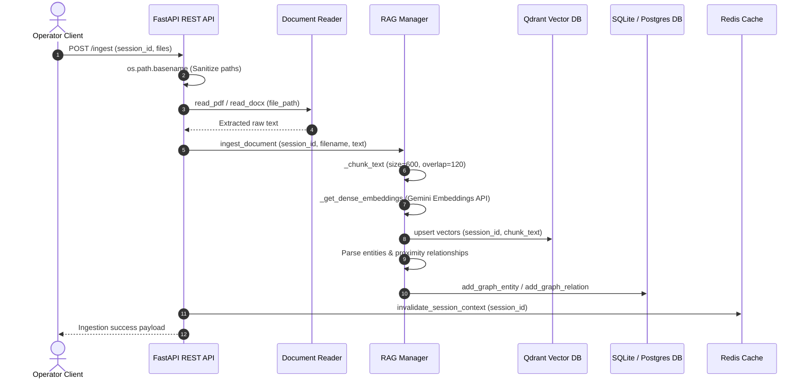
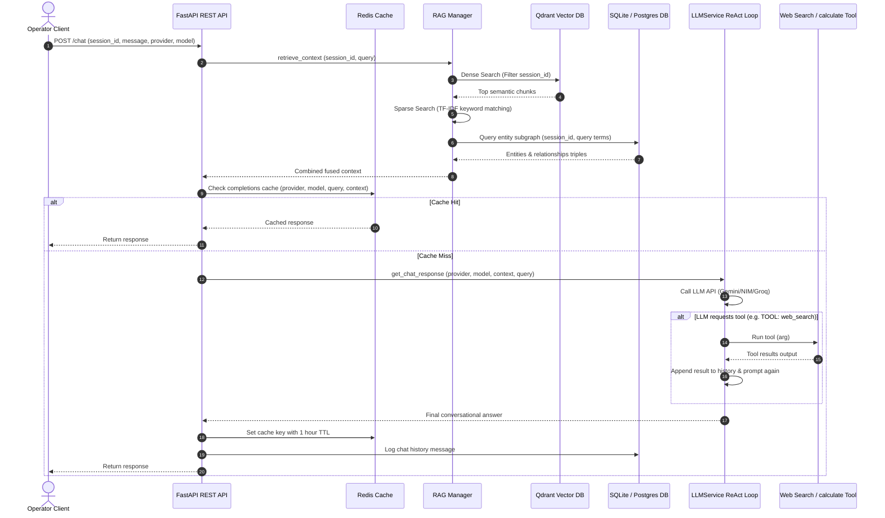

# 🟢 Low-Level Design (LLD) - Matrix Oracle Workspace

This document defines the Low-Level Design (LLD) for the **Matrix Oracle Chatbot and Operator Workspace**, outlining schemas, API payloads, class interfaces, sequence flows, and caching policies.

---

## 1. Class & Interface Definitions

### A. Database Manager (`utils/db_manager.py`)
Provides database portability abstractions between SQLite3 and PostgreSQL.

```python
def get_db_connection() -> Connection:
    """Returns either psycopg2 or sqlite3 connection based on USE_POSTGRES config."""
    
def q(query_string: str) -> str:
    """Replaces sqlite '?' placeholders with postgres '%s' dynamically if USE_POSTGRES is true."""

def init_db() -> None:
    """Creates tables (users, chat_sessions, chat_messages, graph_entities, graph_relations)."""

def add_graph_entity(session_id: int, name: str, entity_type: str, description: str) -> bool:
    """Inserts or updates entity in SQLite/PostgreSQL. Uses ON CONFLICT for Postgres."""

def add_graph_relation(session_id: int, source: str, target: str, relation: str, description: str) -> bool:
    """Inserts or updates relationship in SQLite/PostgreSQL."""
```

### B. Hybrid Graph RAG Manager (`utils/rag_manager.py`)
Coordinates local vector indexing, lexical scoring, and relational knowledge graph parsing.

```python
class HybridGraphRAGManager:
    def __init__(self):
        # Initializes local Qdrant Client (in-memory if testing or running pytest)
        # Sets up the Cosine metric collection with 768 vector dimensions

    def ingest_document(self, session_id: int, filename: str, content: str) -> None:
        # Chunks document text into sizes of 600 chars (120 char overlap)
        # Generates dense vectors via Gemini text-embedding-004
        # Upserts point struct payload {"session_id", "filename", "text"} into Qdrant
        # Parses text against MATRIX_ENTITIES to seed SQLite entity and proximity relation tables

    def retrieve_context(self, session_id: int, query: str, top_k: int = 3) -> str:
        # 1. Dense Search: Queries Qdrant collection filtered by session_id
        # 2. Sparse Search: Matches query terms using simple in-memory TF-IDF over session chunks
        # 3. Graph Search: Scans query for entities, queries SQLite relational subgraph
        # 4. Context Fusion: Merges and deduplicates chunks, appends graph triples, returns prompt context
```

### C. LLM Service (`services/llm_service.py`)
Coordinates ReAct agent reasoning and model routing.

```python
class LLMService:
    def __init__(self):
        # Reads GOOGLE_API_KEY, NVIDIA_API_KEY, GROQ_API_KEY and loads templates

    def get_chat_response(self, provider: str, model_name: str, context: str, question: str) -> str:
        # Appends TOOL_INSTRUCTION to prompt template
        # ReAct loop (Max 2 iterations):
        #   - Calls _execute_model_call(provider, model_name, prompt)
        #   - If TOOL: tool_name(args) is matched:
        #       - Parses arguments
        #       - Runs matching tool from utils/tools.py (web_search, calculate, lore_lookup)
        #       - Appends TOOL CALL and SYSTEM DATA RETRIEVED to prompt text
        #       - Continues loop
        #   - If no tool is matched, returns final response string
```

---

## 2. Sequence Diagrams

### A. Document Ingestion Flow (RAG)


### B. Chat Completion & Retrieval Flow


---

## 3. Database Schema Mapping (Relational vs. Vector)

### Relational Tables (SQLite / PostgreSQL)
1. **`users`**: Manages credential profiles. Password strings are encrypted via bcrypt.
2. **`chat_sessions`**: Session links (Pathways) mapped to a user ID.
3. **`chat_messages`**: Chat logs showing sender type (`user` / `assistant`).
4. **`graph_entities`**: Unique parsed entities per session. Holds entity name, type, and description.
5. **`graph_relations`**: Unique relationships connecting entities. Holds source, target, relation label, and descriptions.

### Vector Points Schema (Qdrant)
* **Collection**: `matrix_rag` (Distance: Cosine, Vector Size: 768).
* **Payload**:
  ```json
  {
    "session_id": 1234,
    "filename": "timeline_archive.pdf",
    "text": "The second Matrix version was created by the Architect to balance human choices...",
    "chunk_index": 4
  }
  ```

---

## 4. Redis Caching Policy

* **Cache Key Patterns**:
  * Chat Completions: `chat:{provider}:{model_name}:{context_hash}:{query_hash}` (TTL: 3600s / 1 Hour)
  * File Parsing: `doc:{filepath_hash}:{mtime}` (TTL: 86400s / 24 Hours)
  * Session Context: `session_context:{session_id}` (TTL: 600s / 10 Mins)
* **Invalidation Trigger**:
  * Uploading a file to `/ingest` calls `invalidate_session_context(session_id)`.
  * Deleting or clearing a session calls `invalidate_session_context(session_id)`.
